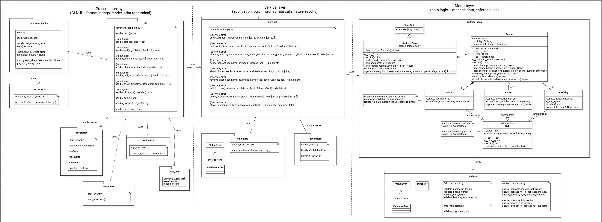
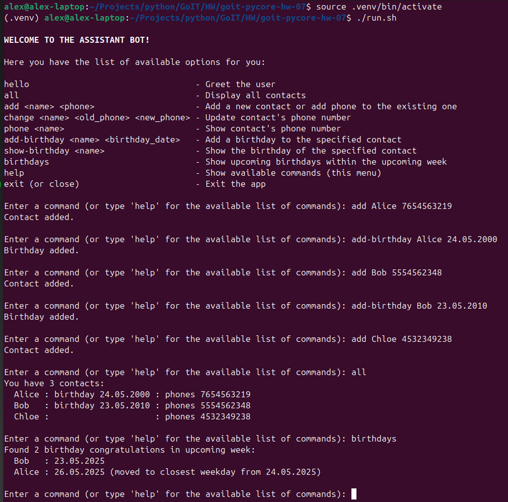

# Python Programming: Foundations and Best Practices 2.0

### [# goit-pycore-hw-06](https://github.com/topics/goit-pycore-hw-06)

<p align="center">
  
</p>


## Basic OOP in Python

<details>

<summary><h3 style="display: inline-block">Project Setup & Run Instructions</h3></summary>

##### Table of Contents
- [Prerequisites](#setup-prerequisites)
- [Setting Up the Development Environment](#setup-setting-up-environment)
  - [Clone the Repository](#setup-clone-repository)
  - [Create a Virtual Environment](#setup-create-virtual-environment)
- [Running the Project](#setup-running-the-project)
  - [Running the Tasks in VS Code](#setup-running-vs-code)
  - [Running the Tasks from the Command Line](#setup-running-command-line)
  - [Running Tasks with Scripts](#setup-running-script)

#### <a name="setup-prerequisites"></a>Prerequisites

Before starting, ensure that you have the following installed:

* [Python 3.7+](https://www.python.org/downloads/) (Make sure python (`python --version` or `python3 --version`) and pip (`python -m pip --version` or `python3 -m pip --version`) are available in your terminal)
* [Git](https://git-scm.com/downloads) (optional, for version control)

#### <a name="setup-setting-up-environment"></a>Setting Up the Development Environment

1. **<a name="setup-clone-repository"></a>Clone (or copy) the Repository**

    If you haven't cloned the project yet, you can do so using:

    ```bash
    git clone https://github.com/oleksandr-romashko/goit-pycore-hw-06.git
    cd goit-pycore-hw-06
    ```

    or download zip archive with code directly [from the repository](https://github.com/oleksandr-romashko/goit-pycore-hw-06/archive/refs/heads/main.zip).

2. **<a name="setup-create-virtual-environment"></a>Create a Virtual Environment**

    * **Linux/macOS (using `bash` or `zsh`):**

      Run the setup.sh script:

      ```bash
      source setup.sh
      ```

      This will:
      * Create a virtual environment (`.venv`).
      * Activate the virtual environment.
      * Install dependencies listed in `requirements.txt`.
      * Set the `PYTHONPATH` for module imports.
      * Set-up pre-commit hook.

    * **Windows (using Command Prompt):**

      If you're using Command Prompt to set up your development environment, you can run the `setup.bat` script:

      ```cmd
      setup.bat
      ```
      This will:
      * Create a virtual environment (.venv).
      * Activate the virtual environment.
      * Install dependencies listed in requirements.txt.
      * Set the `PYTHONPATH` for module imports.
      * Set-up pre-commit hook.


#### <a name="setup-running-the-project"></a>Running the Project

Once your virtual environment is set up, you can run the application code.

* **<a name="setup-running-vs-code"></a>Running the project in VS Code**

  Once the virtual environment is activated and `PYTHONPATH` is set, you can run the project directly from VS Code. Make sure that your `settings.json` (in `.vscode` folder) is correctly set up, as discussed previously.

  VS Code will automatically use the virtual environment and set the correct `PYTHONPATH` if you've configured your settings properly.

  You can launch each task with preconfigured inputs via the debugger ([.vscode/launch.json](.vscode/launch.json)).

  Below is a mapping of launch configurations to their command-line equivalents. You can run them directly or through provided scripts:

* **<a name="setup-running-command-line"></a>Running the project from the Command Line**

  After setting up your virtual environment and setting the `PYTHONPATH`, you can run the project directly from the terminal.

 The command will run the script (please note, that for Linux/macOS you might use `python3` instead of `python` command):

  Command Handler Bot:
  ```bash
  python src/main.py
  or
  python src/main.py --alternative
  ```

* **<a name="setup-running-script"></a>Alternatively, you can use a script to run the project**

  * **On Linux/macOS (shell script)**:

    Run application with the script:
    ```bash
    ./run.sh
    ```

    Make sure the shell scripts have execution permission by running:

    ```bash
    chmod +x ./run.sh
    ```

  * **On Windows (batch script)**:

    ```cmd
    run.bat
    ```

</details>

<details>

<summary><h3 style="display: inline-block; word-break: break-all;">Solution - Introduce OOP to the Console Assistant Bot</h3></summary>

This task is a follow-up of the previous task **[CLI assistant bot](https://github.com/oleksandr-romashko/goit-pycore-hw-05)**, extended by adding OOP related with data and their processing (how data are stored, what data and what we may do with them).

#### <a name="assignment-task-description"></a>Task description:

Implement Address Book Management System using OOP classes.

#### <a name="assignment-solution"></a>Solution:

Solution for this assignment is located in the [src/address_book](./src/address_book) folder and implemented in the following files:
* [AddressBook](./src/address_book/address_book.py) class - stores `Record`'s:
  Functionality:
  * add a `Record` using `add_record` method
  * search for the `Record` using `find` method
  * delete `Record` using `delete` method
* [Record](./src/address_book/record.py) class - stores contact information (`Name` (required) and list of `Phone` objects):
  Functionality:
  * add phone numbers
  * delete phone numbers
  * editing phone numbers
  * find phone number
* [Field](./src/address_book/field.py) class - basic class for `Record` class fields
* [Name](./src/address_book/name.py) class - class to store contact username.
* [Phone](./src/address_book/phone.py) - class to store contact phone number.
* Additional validation checks serving as guards during data processing:
  * [ValidationError](./src/validators/errors.py) - Custom error for validation problems, inherited from ValueError.
  * [args_validators.py](./src/validators/args_validators.py) - Validators for command-line argument structure before further operations.
  * [contact_validators.py](./src/validators/contact_validators.py) - Validators for contact management commands.
  * [field_validators.py](./src/validators/field_validators.py) - Validators for field values (name, phone, etc.).

UML Class Diagram of the solution (created using [Star UML](https://staruml.io/) tool, source file is located [here](./assets/uml/class_diagram-star-uml.mdj)):



Result screenshot - Task solution (launched in the typical mode - menu handling using match case):



Result screenshot - Task solution (Launched in the alternative mode - Data-Driven Menu):


</details>

<details>

<summary><h3 style="display: inline-block; word-break: break-all;">Task requirements</h3></summary>

#### <a name="assignment-task-requirements"></a>Task requirements:

Entities (Classes to Implement):

* `Field`: Base class for record fields.
* `Name`: Class to store the contact's name (required field).
* `Phone`: Class to store a contact's phone number. Includes validation: must have exactly 10 digits.
* `Record`: Class to store a contact's information, incl. a name and phones list.
* `AddressBook`: Class to store and manage multiple Record objects.

Required Functionality:
* `AddressBook`:
  * Add a Record.
  * Find a Record by name.
  * Delete a Record by name.
* `Record`:
  * Add a new Phone.
  * Remove a Phone.
  * Edit an existing Phone.
  * Find a specific Phone.

#### <a name="assignment-recommendations-to-the-implementation"></a>Recommendations to the implementation:

Provided Starter Code:

```python
from collections import UserDict

class Field:
    def __init__(self, value):
        self.value = value

    def __str__(self):
        return str(self.value)

class Name(Field):
    pass

class Phone(Field):
    pass

class Record:
    def __init__(self, name):
        self.name = Name(name)
        self.phones = []

    def __str__(self):
        return f"Contact name: {self.name.value}, phones: {'; '.join(p.value for p in self.phones)}"

class AddressBook(UserDict):
    pass
```

Example How Your Code Should Behave:

```python
book = AddressBook()

john_record = Record("John")
john_record.add_phone("1234567890")
john_record.add_phone("5555555555")
book.add_record(john_record)

jane_record = Record("Jane")
jane_record.add_phone("9876543210")
book.add_record(jane_record)

for name, record in book.data.items():
    print(record)

john = book.find("John")
john.edit_phone("1234567890", "1112223333")
print(john)

found_phone = john.find_phone("5555555555")
print(f"{john.name}: {found_phone}")

book.delete("Jane")
```

#### <a name="assignment-evaluation-criteria"></a>Evaluation criteria:

Class `AddressBook`:

* Implemented `add_record`, that adds to self.data
* Implemented `find`, that finds item by name
* Implemented `delete`, that delets item by name

Class `Record`:

* Implemented `Name` object storage in a separate attribute
* Implement storage of a list of `Phone` objects in a separate attribute.
* Implemented methods for adding - `add_phone` / deletion - `remove_phone` / editing - `edit_phone` / search of `Phone` object - `find_phone`.

Class `Phone`:

* Implemented validate that the phone number has exactly 10 digits.

</details>
